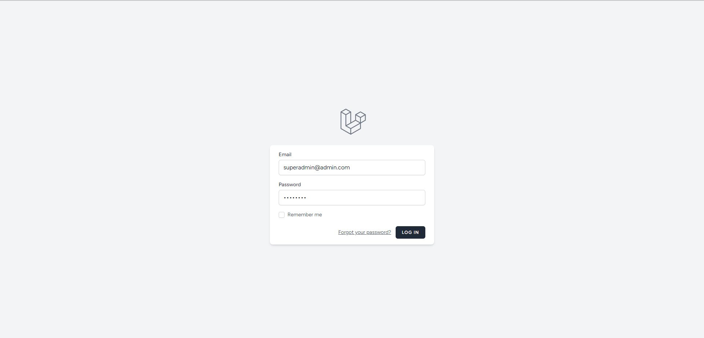

<h1 align="center">Basic Laravel Admin Panel</h1>
<h3 align="center">A basic and simple admin panel for Laravel projects.</h3>

## Built with
- [Laravel 10](https://github.com/laravel/framework)
- [spatie/laravel-permission](https://github.com/spatie/laravel-permission)
- [Laravel Breeze](https://github.com/laravel/breeze)
- [Bootstrap 5](https://getbootstrap.com/)
- [AdminLTE](https://adminlte.io/)

## Installation
- To get started, you need to install [PHP Composer](https://getcomposer.org/).
- `git clone https://github.com/Athul-Suresh/default-admin-app.git`
- `php artisan migrate`
- `php artisan db:seed`
- `npm install`
- `npm run dev`
- `php artisan serve`
- Now open http://localhost:8000/

###### Super Admin Login
- Email - superadmin@admin.com
- Password - password

## Screenshots

	
	  

## License

The Laravel framework is open-sourced software licensed under the [MIT license](https://opensource.org/licenses/MIT).
